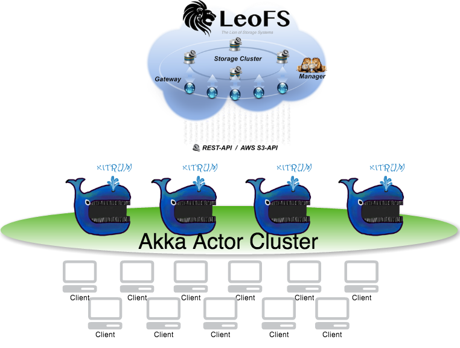

Demo of `Xitrum <http://ngocdaothanh.github.com/xitrum>`_ with `LeoFS <http://www.leofs.org/>`_
===============================================================================================

About
=====

This is a Demo for LT of `Rakuten Technology Conference 2013 <http://tech.rakuten.co.jp/>`_.

See also: `Slide <http://slid.es/georgeosd/introduction-of-xitrum>`_.

Getting started
===============

1. Install and Start LeoFS

   Follow `LeoFS Official Document <http://www.leofs.org/docs/getting_started.html>`_

2. Get API key from `LeoFS Manager Console <http://www.leofs.org/docs/getting_started.html#get-your-s3-api-key-from-the-leofs-manager-console>`_ and edit `config/leofs.conf`

::

    # Config Leofs
    # See also http://www.leofs.org/docs/s3_client.html#getting-started-with-java-aws-sdk
    leofs {
        # leo_gateway
        proxyhost = "localhost"
        proxyport = 8080

        # You can get S3 API Keys from LeoFS' Manager Console.
        # http://www.leofs.org/docs/s3_client.html#getting-your-s3-key
        accessKeyId = "YOUR ACCESS KEY ID HERE"
        secretAccessKey = "YOUR SECRET ACCESS KEY HERE"

        bucket = "xitrum-leochat"
    }

3. start xitrum instances

::

  sbt/sbt xitrum-package
  sh dev/8000.sh
  sh dev/8001.sh (from another terminal)
  sh dev/8002.sh (from another terminal)

Now you have clustered instances running at http://localhost:8000/ and https://localhost:8001/
